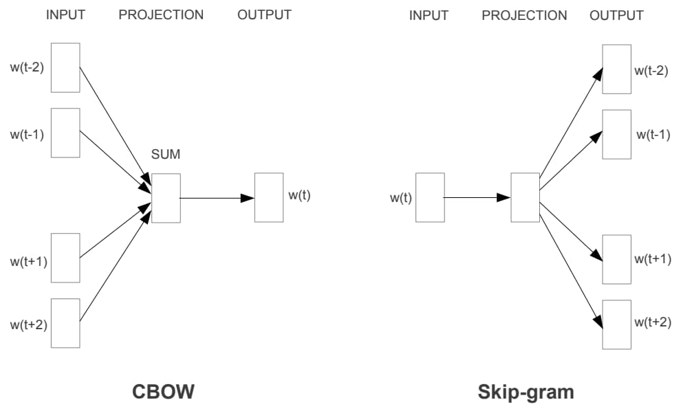

# 1. What is Word Embedding?

Natural language is a complex system used to convey meaning. In this system, words are the fundamental units of meaning. As the name suggests, word vectors are vectors that represent words and can also be considered feature vectors or representations of the words. **The technique of mapping words to real-number vectors is called word embedding.** In recent years, word embedding has become foundational knowledge in natural language processing (NLP).

In the field of NLP, text representation is the first and very important step. Simply put, this involves converting human language symbols into numbers that machines can calculate, as machines cannot directly understand ordinary text language. Early methods relied on rule-based transformations, while modern methods use statistical machine learning techniques.

Data determines the upper limit of machine learning, while algorithms aim to approach that upper limit. In this context, data refers to text representation. Therefore, understanding the development of text representation is essential for NLP learners. Let's explore this development journey. Text representation is divided into **discrete representation** and **distributed representation**:

---

# 2. Discrete Representation

## 2.1 One-hot Encoding
One-hot encoding is one of the most common methods in feature engineering. Its process is as follows:
1. Construct a dictionary from the tokenized text, where each token is assigned a unique bit value (0 or 1).
2. Each token's text representation is a matrix where its bit position is 1, and all other positions are 0.

### Example:
```
John likes to watch movies. Mary likes too.
John also likes to watch football games.
```

The dictionary can be constructed as:
```
{"John": 1, "likes": 2, "to": 3, "watch": 4, "movies": 5, "also": 6, "football": 7, "games": 8, "Mary": 9, "too": 10}
```

Using one-hot encoding:
```
John:   [1, 0, 0, 0, 0, 0, 0, 0, 0, 0]
likes:  [0, 1, 0, 0, 0, 0, 0, 0, 0, 0]
...
```

### Limitations of One-hot Encoding:
- As the corpus grows, the dimensionality of the data features increases, resulting in a very high-dimensional and sparse matrix.
- This method is independent of the order of tokens in the sentence and cannot capture relationships between words.

---

## 2.2 Bag-of-Words Model
The Bag-of-Words (BoW) model represents a sentence or document as a "bag" containing its words. This representation ignores grammar and the order of words.

### Example:
Using the same sentences:
```
John likes to watch movies. Mary likes too.
John also likes to watch football games.
```

The dictionary remains:
```
{"John": 1, "likes": 2, "to": 3, "watch": 4, "movies": 5, "also": 6, "football": 7, "games": 8, "Mary": 9, "too": 10}
```

The vector representation for the first sentence is:
```
[1, 2, 1, 1, 1, 0, 0, 0, 1, 1]
```
Here, `2` indicates that "likes" appears twice.

### Limitations of Bag-of-Words:
- After vectorization, words are ranked in magnitude, but higher frequency does not necessarily mean higher importance.
- There is no sequential relationship between words.

---

## 2.3 TF-IDF
TF-IDF (Term Frequency–Inverse Document Frequency) is a common weighting technique used in information retrieval and data mining. 
- **TF (Term Frequency):** Measures how frequently a term occurs in a document.
- **IDF (Inverse Document Frequency):** Measures how important a term is by penalizing terms that are frequent across the entire corpus.

TF-IDF is computed as:

```
TF-IDF(w) = TF(w) * log(N / (DF(w) + 1))
```

Where:
- `TF(w)` is the term frequency of word `w` in the document.
- `N` is the total number of documents.
- `DF(w)` is the number of documents containing the word `w`.

### Limitations:
- Still does not capture the sequential relationships between words.

---

## 2.4 n-gram Model
The n-gram model considers word order by applying a sliding window of size `n`. For instance, in a **2-gram model**, pairs of words are treated as a single token, sliding one word at a time.

### Example:
Using the same sentences:
```
John likes to watch movies. Mary likes too.
John also likes to watch football games.
```

The dictionary becomes:
```
{"John likes": 1, "likes to": 2, "to watch": 3, "watch movies": 4, "Mary likes": 5, "likes too": 6, "John also": 7, "also likes": 8, "watch football": 9, "football games": 10}
```

The vector for the first sentence is:
```
[1, 1, 1, 1, 1, 1, 0, 0, 0, 0]
```

### Limitations:
- As `n` increases, the vocabulary grows exponentially, leading to a massive dictionary.

---

## 2.5 Problems with Discrete Representations
For general NLP tasks, discrete text representations can solve many problems. However, for scenarios requiring high precision, they are not suitable due to the following issues:
1. Cannot measure relationships between word vectors.
2. Vocabulary size grows with the corpus, leading to inefficiencies.
3. n-gram sequences grow exponentially with corpus size, further exacerbating the problem.
4. Sparse representations lose information, unlike how humans naturally understand language.

# 3. Neural Network Representation

## 3.1 Word2Vec
### Model Structure 
The Word2Vec model structure is similar to the earlier NNLM (Neural Network Language Model), but the training methods differ. Word2Vec offers two training methods:
- **CBOW (Continuous Bag-of-Words)**: CBOW predicts the current word based on its surrounding words. The current word is treated as `y`, while other words in the window are treated as input `x`. The input `x` is encoded using one-hot vectors, passed through a hidden layer, and summed. Finally, a softmax activation function is applied to compute the probability of each word. The goal is to train the network's weights to maximize the overall probability of generating all words in the corpus. The resulting weight matrix is the word vector representation.
- **Skip-gram**: Skip-gram predicts the surrounding context words using the current word. The current word is treated as `x`, while the context words in the window are treated as `y`. Like CBOW, a hidden layer and softmax activation function are used to predict the probabilities of the other words.



### Optimization Techniques

#### 1. Hierarchical Softmax
Calculating softmax for every word in the vocabulary is computationally expensive. To address this, **Hierarchical Softmax** uses a Huffman Tree to encode the vocabulary at the output layer. The vocabulary is represented as leaf nodes in the tree, with high-frequency words placed closer to the root. This reduces the dimensionality to the depth of the tree, as shown below:

A **Huffman Tree** is a binary tree constructed such that the weighted path length is minimized. Nodes with higher weights are closer to the root.

#### 2. Negative Sampling
Negative sampling reduces the computational cost by sampling negative examples from the dataset. Instead of computing probabilities for all words, only a subset of "negative samples" is used. Each word in the vocabulary corresponds to a segment in the range \([0, 1]\), and negative samples are chosen randomly based on this distribution:


### Issues with Word2Vec

- **Local Context Window**: Word2Vec trains on local context windows independently, without leveraging statistical information from the global co-occurrence matrix.
- **Polysemy**: Word2Vec cannot effectively represent polysemous words (i.e., words with multiple meanings) as it assigns a single vector representation to each word.

### Why Not One-Hot Vectors for Word Embedding?

Although one-hot word vectors are easy to construct, they are generally not a good choice for word embedding. The primary reason is that one-hot vectors fail to accurately capture the similarity between different words. 

#### 1. Key Limitation: Lack of Semantic Similarity
A common metric for measuring word similarity is **cosine similarity**. However, for one-hot vectors:
- Any two different words have a cosine similarity of `0`.
- This means that one-hot vectors cannot effectively represent the relationships or similarities between words.

#### Example:
Given two words:
- **"cat"** → [1, 0, 0, 0, ...]
- **"dog"** → [0, 1, 0, 0, ...]

The cosine similarity between these two one-hot vectors is:
```
cosine_similarity(cat, dog) = 0
```

Even though "cat" and "dog" are semantically similar in the sense of being animals, the one-hot representation does not reflect this relationship.

#### 2. High Dimensionality:
   - The size of the vector is equal to the vocabulary size. For large corpora, this results in very high-dimensional and sparse matrices.
   
#### 3. No Contextual Information:
   - One-hot encoding does not include any information about the context in which a word appears.

#### 4. Inefficient for Machine Learning:
   - Sparse representations increase computational costs and are less effective for modern machine learning models.
